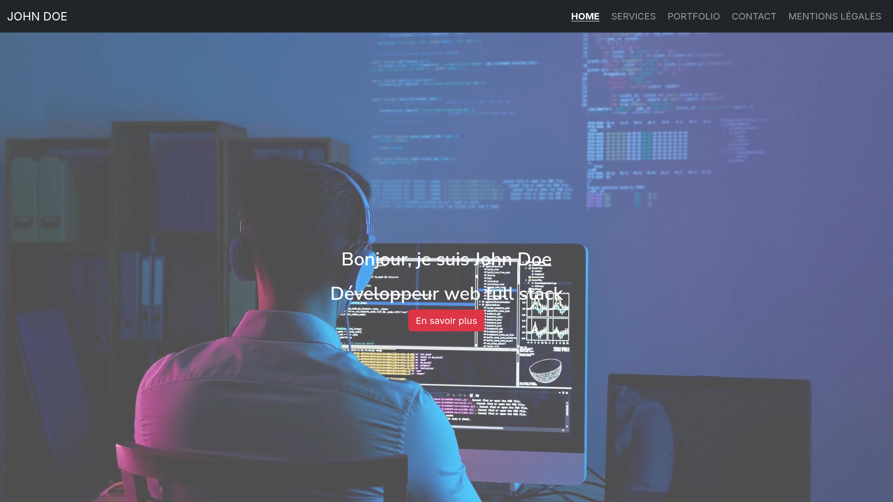

# 🌐 John Doe - Portfolio



## 🌱 A propos

**Portfolio** de John Doe, développeur web fullstack présentant **compétences et réalisations**.

## 🖥️ Stack

- HTML5
- CSS3
- JavaScript ES6
- Bootstrap 5
- React 19+

## Prérequis

> [!IMPORTANT]
> Vous aurez besoin de **Git** et **Node 18+** pour exécuter les commandes ci-dessous et le bon fonctionnement de l'application.

## 🚀 Installation & lancement

1. **Cloner le dépôt**
```bash
   git https://github.com/loickcherimont/devoir-portfolio-reactjs.git
   cd ./devoir-portfolio-reactjs
```

2. **Récupérer les dépendances**

```bash
   npm install
```

3. **Lancer le projet**

```bash
   npm run dev
```

4. L'application est disponible à cette adresse: [Lien vers l'application](http://localhost:5173)


